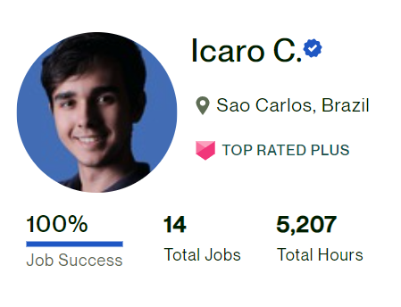

 

**Simplicity and honesty**

I respect and admire the work of companies like Vercel, Airtable, Microsoft, and GitHub. Often I go for them as reference on how I should go about my work as a programmer.

However, seeing that these companies are huge, I recognize that they deal with a level of complexity that is unparalleled, which has little to nothing to do with my work as a mere freelancer.

So instead of trying to copy these giants, I aim to discover what I should be building in the context that I work in, that is, the context of a freelancer (which is complex enough in itself).

> One Repo to master them all, One Repo to track them, One Repo to merge them all, and in Version Control bind them...
